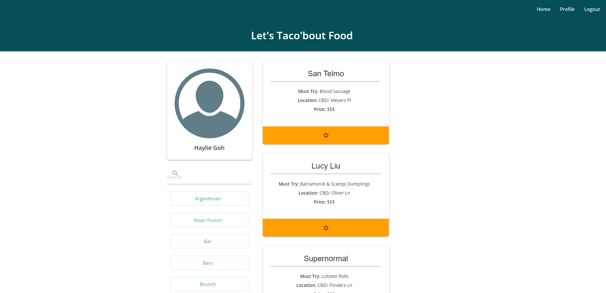
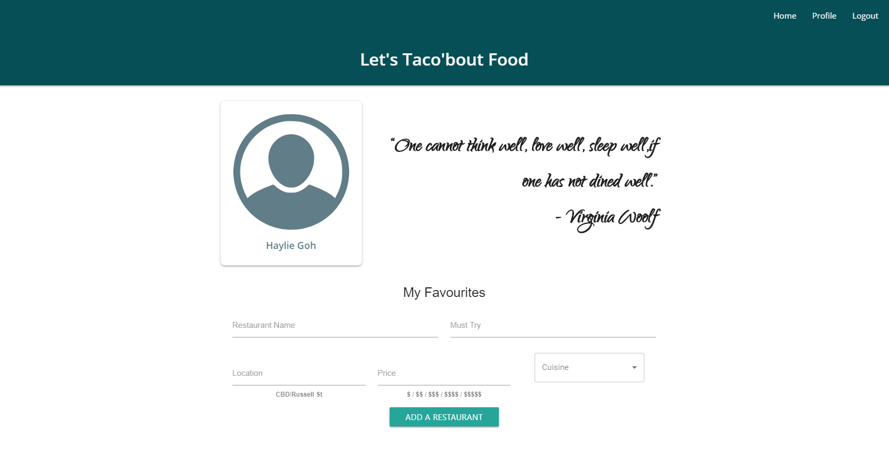

# Let's Taco'bout Food

## Description

 

Let's Taco'bout food is a fun app that I've created to store the restaurants I have visited throughout the years in our little city - basically my little restaurant list. It's a place where my friends and family can go to for foodspo (food inspiration) and begin their own food adventure.

A user of this application is able to post a restaurant they've recently been to under their profile. This will add the list into the overarching restaurant list where other users can browse through by name or category. Please bear in mind that posting and browsing content is limited to registered users.

## Deployment

_This application has been deployed here:_ https://boiling-ridge-72775.herokuapp.com/

## Table of Contents

- [Technical Features](#technical-features)
  - [Full Stack](#full-stack)
  - [User Authentication and Security](#user-authentication-and-security)
  - [Responsive Web Design](#responsive-web-design)

## Technical Features

### Full Stack

The front end of this application is built using Materialize component library and Material UI along with React as a framework.

Tha backend is powered by Node.js with express as the server adn MySQL as the database. Sequelize was also utilised for our models.

Resulting a full stack application that has both front and back end components.

### User Authentication and Security

Express-session and passport middlewares were used to maintain user sessions as well as the process of authenticating our user requests. Additionally all passwords in the system has been hashed using bcryptjs before being pushed into the database. This prevents any person with access to the database from being able to view or use the passwords of users in the system.

### Responsive Web Design

The site is responsive, pages renders as it should and functions as it should across different screen sizes. To achieve this, We have used the Materialize front-end component library was utilised.

## Application Preview

Preview of the application below:

 

Upon signing in, users will be able to view the homepage

As well as navigate to thei profile page where the posting of a new restaurant can be created.

